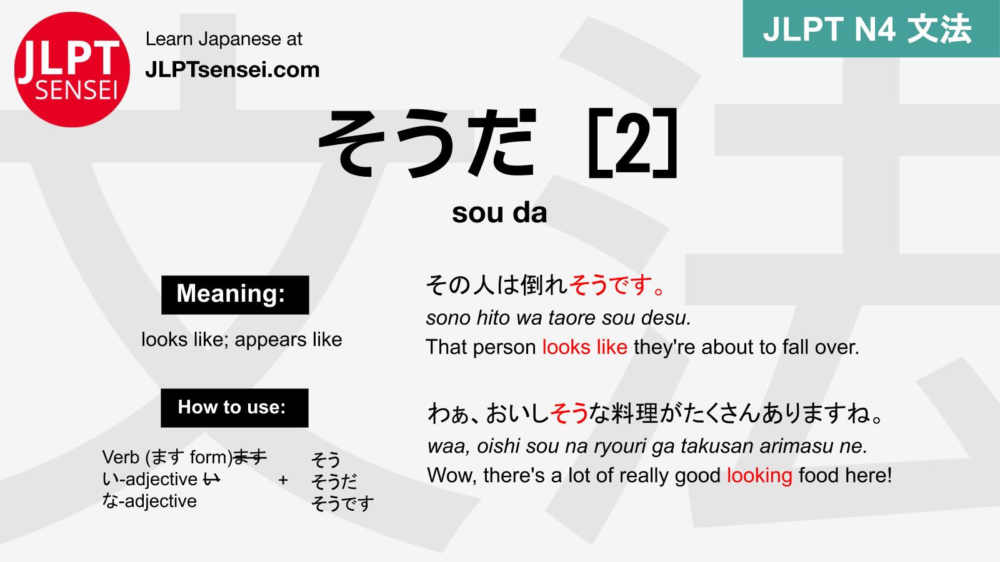

# KAI Level 3 Grammar Digest

* TOC
{:toc}

## L24-1: 自動し、他動詞
- 自動詞 -> intransitive verb
- 他動詞 -> transitive verb

## L24-2: て-forms of state-changing 自動詞
using the て-form of a state-changing 自動詞 conveys that something is in that state  

### Examples
- > 電気がつきます -> the light turned itself on  
- > 電気が点いている -> the light is on

## L24-3: ので
ので has the same meaning as から, but

- is more polite
- has the feeling of "sorry", like てしまいました
- is only used when talking to superiors  
  

## L24-3: そう
### Recab: Lvl1 そう
The そうです from Level 1 could attach to verbs and adjectives to say that something *looks* a certain way  
  

### Lvl2 だそう
The new way of using そう attaches to verbs and adjectives differently, and can also be used with nouns.
It is used to convey second hand information.  
  

## L25-1: まま
まま is used to express that a thing has been put in a state, and then remained in that state.

  

### Examples
窓を開けたまま、寝ちゃった。

## L25-2: てみます
Meaning "to try to do something that one has not done before"  

When talking about doing something unknown, this form is recommended.

### Examples
- > **歌ってみる** -> I'll try singing
- > 靴を**履いてみて**もいいですか。 -> Is it ok to try on these shoes?  
- > ハワイに行ったことがない。でも**行ってみたい**。 -> I have not been to Hawai. But I want to go.
- > A: そのケーキ、食べたことがない。  
> B: そうですか。じゃあ、**たべてみてください**.

## L25-3: ておく
Meaning:
1. to do something in preparation
2. To keep something as it is  

sometimes when speaking, instead of ...てお..., people abbreviate to と 
eg: スライドを作っ*てお*いてください -> スライドを作っ*と*いてください
### Examples
#### Meaning 1: to do something in preparation
- > エアコンをつくておきます -> to turn on the aircon (eg. in preparation for a meeting)  
- > エアコンをつけておいてください -> please turn on the AC in preparation  
- > 水を買っておいて方がいいです -> it is recommended to buy water in preparation  
- > テストの前に、勉強をしておかなくてはいけません -> before the test, you must study in preparation  

#### Meaning 2: to leave something as it is
- > 話さないでおいてください: stay quiet please  
- > 椅子を置いておいてください: please leave the chair where it is  

## L25-4: __ところ

- dict.ところ: just about to ___
- ている ところ: doing ___ (and that is the reason for something, eg. that I can't talk right now)
- た ところ: just finished ___  

  
  
  

### Examples
> - 今パスタを食べるところから、出かけない。すみません。 -> I'm just about to eat pasta, so I can't go out. Sorry.

> - 今ゲームしているところので、後で話してもいい。 -> I'm in a game right now, can we talk after?

> - 今そうじしたところなので、部屋はきれいです。通常は...汚い。-> I just cleaned my room, so it's clean. Usually... dirty 🙃.

## L25-5: ために
ために  translates as "for the sake of"...   

### example sentences:
漫画がわかるために、勉強します -> for the sake of understanding manga, I study

明日元気になるために、今日早く寝ます。 -> To be genki  tomorrow, i am going to sleep early.

## L26-1: てある
てある is used to emphasize that something has already been done, and the resulting state influences the present.

For the usage, just take the て form of a verb, and add あります。

It takes a 他動詞, but the を changes to が.  
*(or sometimes は, depending on the は/が rules)*

### ておきました vs てあります
てあります conveys the same information as ておきました: something has been done, and that is relevant right now.  
However, the focus is different.

ておきました focusses on the action, that *someone did it*.  
てあります focusses on the fact that the thing has been done, and the result of that.

- > エアコンがつけてあります -> *The aircon* is turned on now.
- > つけておきました -> *I turned on* the aircon.

It's essentially the difference between "It has been done" and "I have done it".

### Examples
- > お茶が買ってあります -> the tea has been bought.
- > 部屋が飾ってあります -> the room has been decorated

## L26-2: みたい、のよう
### みたい
みたい is used to say that something is *like* something else.  
みたい itself is a な adjective.

#### Examples
- > 雲が魚みたいです -> The cloud looks like a fish

- > イタリアは形がブーツみたいな国 -> Italy is the country with the shape like a boot

- > 怒ると、鬼みたいに怖いです -> If he get's angry, he gets scary like a demon

### のように
Instead of みたい, you can also say のよう.  
It's a lot more formal.

#### Examples
- > 仕事が山のようにあります

## L26-3: ようだ, みたい
- ようだ,みたい **with the plain forms of a verb** is used to say that something appears a certain way, based on *indirect information*.  
- For example, when your fish is gone and you see cat footprints:  
- 猫が食べたようです。
- It is related to level 1 そうだ, where the source of the information was external.
- Can also use みたい instead:

### Examples:
- > 猫が魚を食べたようです。 -> it looks like the cat ate the fish.
- > あの人はけんかするみたいです。 -> it looks like those people are having an argument.
- > あの人は眠いようですね。 -> that person looks tired
-> テレビがなくて、クリストファーさんの髪が見つけました。クリストファーさんは泥棒のようです。 -> My TV is gone, but I found christophers hair. Christopher looks like a thief

## L27-1: The Passive Form: 受身機
Japanese has a passive form.  
It is used whenever the subject of the sentence has no control over the predicate.  
More specific rules below.

It is formed like this:

- 一段 (Group 2): verb stem + られる
- 五段 (Group 1): <strike>u</strike> -> a + れる
- Irregulars:
  - する -> される
  - くる -> 来られる

- The passive recipient of the action is the subject of the sentence, while the active person / object is marked with に or から
  - (the usage is like もらう)
- Passive form 他動詞 Verbs can still take direct objects. See the examples.
- When forming the 受身機, there is no practical difference between 一段 and 五段.  
  - (In effect, you can apply the rule for 五段 to every regular verb).
- The result of this formation is a 一段 verb.
- The 可能け and 受身機 of 一段 verbs look the same (eg 食べられる).

### Usage
There are 3 Situations in which the 受身機 is used in Japanese.

#### Regular passive
When the subject of a story is of the receiving end of an action, the passive is used.

- > 田中さんは山田さんにさそわれました。 -> Tanakaさん was invited by Yamadaさん.
- > 娘は母に絵を褒められました。-> The daughter was praised by the mother for her drawing.

#### Talking about people being negatively affected by 他動詞
When talking about someone being hurt, emotionally or physically, by someone else doing something without their consent, the passive form is often used.

- > 林さんは森さんにケーキを食べられました。 -> Tanakaさん's cake was eaten by Moritaさん.
- > 小川さんは中野さんにロブレーターを読まられました。 -> Kogawaさん's love letter was read by Naganoさん.
- > 好きな人に断られました。-> I was rejected by the person I liked

#### Talking about people being negatively affected by 自動詞
When someone is negatively affected by someone/something doing a 自動詞 action, the passive form can also be used.

- > 新宿駅に、西田さんは女の人に泣かれました. -> Nishidaさん was cryed on by some woman at Shinjuku station.
- > 中田さんは雨に降られました -> Nakataさん was rained on.
- > 田中さんはセールスマンに家に来られました -> Tanakaさん interrupted by a salesman coming to her house.

### Usage, Part 2
#### Saying who made something:
If the person who made / built something is someone important of famous, instead of に, によって is used.

- > This building was built by Jonny Ive -> このビルはアイブジョンニによって建てられました。

#### Saying what something is made of / from
When the constituents of a thing are still discernable, we say the thing is made *of* those things.  
When the thing is made from things that have been processed irreversably, beyond recognition, we say it is made *from* those things.

Japanese makes this distinction too. *Of* translates to *で*, and *from* to *から*.

- > This building is made *of* stone. -> このビルは石*で*造られています。
- > 日本酒はお米*から*作られています。-> Sake is made *from* rice.

#### て form of 受身形
The passive has a て-form, which expresses state.

- > この本は多くの人に読まれています -> This book is read by many people

## L27-2: Level 3 たら
In Level 3, たら is used to describe a situation of the type: *Because of something I did, I noticed something else happened / happening, that I cannot control*.  
It carries a surprised subtone, and often describes an unfortunate situation.

### Examples: 
- > スマホを落としたら、割れて*しまいました*。 -> I dropped my smartphone and it broke.
 - (Dropping the smartphone is my fault, the result I had no direct control over)

- > 古い牛乳を飲んだら、気持ちが悪くなりました。-> I drank old milk and got sick
  - (Drinking the milk is my fault, getting sick was out of my hands after that)

- > スーパーへ行ったら、偶然友達に会いました - > I went to the supermarket and met a friend by chance.
  - (Note: the second half of the sentence is often bad, but does not have to be. In this case, the meaning is simply that you were surprised.)

- > 箱を開けたら、皿が割れていました。-> I opened the box and the plates were broken
  - (Because they were broken before; opening the box was not the action that caused them to break; only the thing that made me notice their ongoing state-of-brokenness, the て-form is used.)

- > 窓を開けたら、雪が降っていました。-> I opened my Window and noticed it snowing.

## L27-3: のに
のに means despite / even though.  

 

### Difference to けど
Compared to けど, のに focusses on the "despite"ness of it, is used to emphasize how unexpected the second part of the sentence is.

- > "She studies all week, passed all preparation tests, was the best in class all semester, but failed the exam".
  - In this case, you would use のに

けど is a regular but. It can be used even when the first part of the sentence doesn't make the second half that unlikely.

- > He was kind of bad all semester and did not take studies seriously. He crammed on the night before the test, but alas, he didn't pass.
  - In this kind of situation, you use けど.

### Examples:
- > 今日は寒いのに、彼はTシャッツを着ています -> Even though it is cold, he wears a T-shirt.
- > 今日は雪なのに、彼はTシャッツを着ています。 -> Even though there's snow today, he wears a T-shirt.
- > しゅくだいがかんたんなのに、誰にもわかりませんでした。 -> Even though the homework was easy, noone understood it.
- > 今日は雨が降っているのに、ジョッギングがした。 -> Even though it is raining today, I want to go jogging.

## L28-1: ば
ば is the japanese way to express a *hypothetical conditional*.

It is often used to make sentences explaining a way to do something (If you did this, then you would get better). The result of a ば sentence should be a positive thing. For negative consequences, use たら.

### How to form the ば form
#### Verbs:
- 五段: u -> eば
  - eg: 飲む -> 飲めば
- 一段: る-> れば
  - eg: 食べる -> 食べれば
- Irregulars:
  - する -> すれば
  - くる -> くれば
- notably the 一段,  五段 and even irregular rules are the same in practice. You can treat every verb as if it were 五段, just taking the last letter of the dict. form, changing it to the equivalent *e* sound, and adding ば

#### Adjectives:
- い: い -> ければ
  - eg: 可愛い -> 可愛ければ
- な: な -> ならば
  - eg: きれい -> きれいなれば
- exception: いい -> よければ

#### Nouns:
- Same as な adjectives

### Examples

- > できれば, ９時までにしてください -> if you can, please do it until 9pm.
- > アパートはいつまでに出ればいいですか -> Until when should I have moved out of the apartment?
- > Q: どうするば、日本人の友達が作れますか。 -> if I did what, I would get japanese friends?
- > A: 居酒屋で飲めば、いろいろな人が会えますよ -> if you go to an izakaya, you're able to meet all kinds of people there
- > Q: どこにいけば、可愛いメイドが見れられますか。 -> Where's a place that if I went to it I would be able to see cute maids?
- > 秋葉原に行けば、メイドがいますよ。 -> If you go to Akihabara, there are maids there よ.

## L28-2: Xば...Xほど, Y
Xば...Xほど means "the more X, the more Y". X can be a Verb or an い-adjective, Y has to be subsentence indicating some state change.

### Example sentences:
- > 勉強すればするほど、上手になる -> the more I study, the better I (will) become.
- > 飲めば飲むほど、わからなくなってしまいます。 -> The more I drink, the less I (will) understand.
- > 寝なければ寝ないほど、疲れます -> The less I sleep, the more exhausted I become.

## L28-3: ようにしている
### Base case: ようにする
**Xようにする** means to try to do something *that is hard but you think you are supposed to do or feel it's better to do*.  
It differs from **Vてみる**, which meant to try something *out*, or *to try something that you're free to do or not do*.

### L28-3: ようにしている
The て form of this, ようにしている then means *trying to continually doing something that is hard, but worth it*. For example eating healthier food, studying diligently, exercising etc.

#### Examples

- > 健康のためにハンバーガをあまり食べないようにしています。 -> I'm trying my best to eat less hamburgers for the sake of my health.
- > あの人と会うとすぐけんかになってしまうので、会わないようにしているんです -> When I meet that person we quickly get into a fight, so I'm trying not to meet them.
- > 環境保護のために、水を使いすぎないようにしています。 -> For the sake of the environment, I'm trying not to use too much water. 

### ようにしてください
Using ようにしてください, one can then make a polite request, eg to customers or patients.

#### Examples:
- > 医者: *できるだけ*、タバコを吸わないようにしてください。 -> Doctor: *If you can*, please try not to smoke.
- > 電車の中で: "傘を忘れないようにしてください" -> Inside the train: "Please try not to forget your umbrella".

## L28-4: ように:
This lesson was about the general ように, which expresses the purpose of an action. This is similar to ために (L25-5), but whereas ために was used to express an *ambition*, a goal for which an action is performed, ように expresses a *hopefull wish* that the performed action will make things better and not worse.

> 子供が食べられるように、りんごを小さく切っています。 So that the child *may be able to eat it*, I'm cutting the apple into small pieces

ように can be appended to:
- the 可能形 of 他動詞 verbs
- state-changing 自動詞 verbs
- and ない形
  - In this case, the hope is that the situation doesn't worsen in some way.

### Examples
- > 読めるように、もっと大きく書いてください。-> So that I may be able to read it, please write bigger.
- > 病気が治るように、神様に祈ります。-> I pray to god that the sickness may disappear.
- > 忘れないように、メモをします。 -> So that I may not forget, I take notes.
- > 魚が腐らないように、冷蔵庫に入れておきます。 -> so that the fish may not rot, I'm putting it in the fridge.
- > 授業に間に合うように、１０分前に来るようにしています。 -> So that I may be in time for class, I'm trying to be there 10 minutes earlier.

## L29-1: 使役形: The Causative Form
The primary meaning of the 使役形 is to *make* someone do something. It can also mean to *let* someone do something, often in combination with くれる.

The person who is making / letting someone is the subject of the sentence. The adressed person is marked with に in case the conjugated verb as a 他動詞, and with を in case it is a 自動詞.

### Examples:
- > お姉さんたちシンでレラに掃除をさせました。The sisters made Cinderella do cleaning.
- > 社長は社員に会社をやめさせました。-> The president made the employee quit.
- > コーチは選手を走らせました。 -> The coach made the player run.
- > 先生は学生をデパートに行かせました。 -> The teacher made the student go to the department store.

- > アルバイトをさせてくれませんでした。 -> my parents wouldn’t let me work
- > 子供の時に、ご両親は私にPCゲームをさせてくれました。 -> When I was a child, my parents let me play PC games

- > 子供は若い時スマホを使わせたくない。->I don’t want to let my children use smartphones when they’re young
- > 吸わせてもらえませんか? -> would you let me sit here?
- > 写真を撮らせてもらえませんか。 -> Will you let met take a picture?

## L29-2: ことにします
ことにする means "to decide on doing something". It expresses the subtext that you have thought through your decision, and are sure about it.

At KAI, only ことにする is tought in level 3, but the grammar can also be used for nouns.

  

### Examples
- > 大学に行くことにしました -> I have decided to go to University.
- > 大学に行かないことにしました -> I have decided not to go to university
Teslaにします: I have decided to buy the Tesla  
ビールにします: I have decided on the beer.  
  - (In this case, you might not have thought about it all that much, but want to assure the waiter that you are sure about your decision)

## L29-3: ことになる
When it isn't (just) you who made the decision, but someone else, or a group you are part of, you use ことになる.

In the て-form, this grammar can be used to say that something *is decided* to be a certain way, as a rule

### Examples
<!-- TODO: Examples -->

## L29-4: Level 3 ばかり

## Random grammar pieces
This section is for random grammar things discussed in class, but too small for their own section.

### 中々 ___ ない
中々 ___ ない is a way to say that something is not easy; proressing annoyingly slow.

- > なかなか返事が来ません -> they're not replying.
- > なかなか上手になりません -> I'm not really getting good.
- > なかなかバスが来ません: The bus is not coming
- > なかなか起きられません: It's hard for me to get up

<!--### TODO: まで vs までに

９時まで勉強してください: pls do benkyou the whoooole time until 9
９時までに勉強してください: pls do benkyou at some point before 9 
５時まで払ます: you are in the continual state of being able to -->